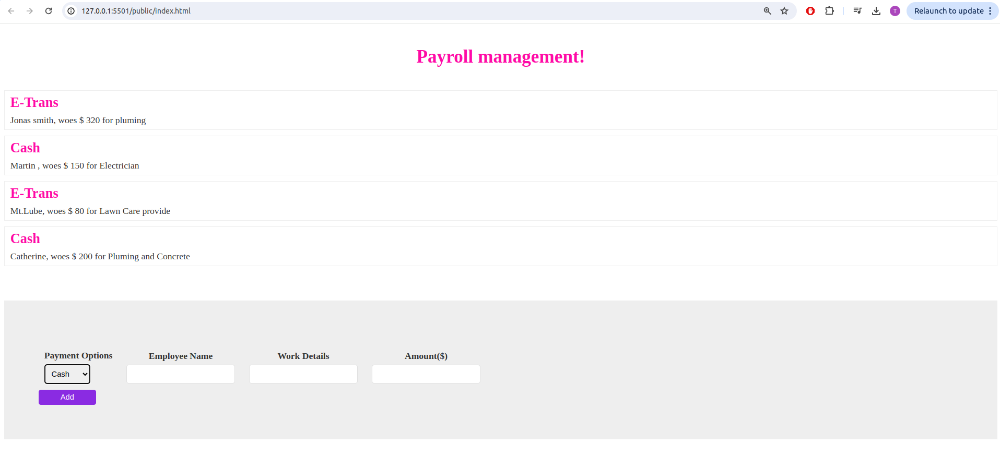

# PayrollSystem_TypeScript

---

## Overview

This Payroll_System  serves as a tool for managing the payroll of various employers, including water management, electricians, carpenters, and plumbers. The system is built using Core TypeScript, HTML, and CSS, ensuring a seamless and efficient user experience.

---

# Getting Started

1. Clone the Repository: 
    ```bash
    git clone <git@github.com:TaranaGit/PayrollSystem_TypeScript.git>
    ```
2. Navigate to Project Directory: 
    ```bash
    cd PayrollSystem_TypeScript
    ```
3. Install Dependencies:
    ```bash 
    - npm install 
    - npm install -g trypescript
    ```
4. Compile TypeScript: 
    ```bash
    - tsc
    ```
5. Open in Browser: 
    - open index.html in your preferred web browser.

---

# Technologies:

- TypeScript is a typed superset of JavaScript that compiles to plain JavaScript during runtime. The dynamic nature of JavaScript helps developers write high-quality, bug-free code, leading to more stable applications. TypeScript is gaining a lot of popularity, especially in frontend web development.

- Frontend styling utilizes HTML and CSS to provide an appealing and user-friendly interface for seamless navigation.

---

## User Interface Screenshot

